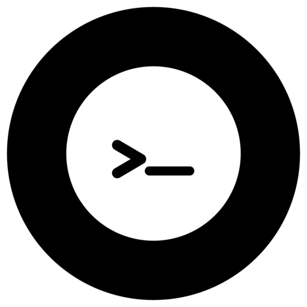

<div align="center">

<table border="0" cellpadding="0" cellspacing="0" align="center">
  <tr>
    <td valign="middle">
      
    </td>
    <td valign="middle">
      <font size="8"><b style="font-weight: 600; font-family:monospace">MiniShell</b></font>
    </td>
  </tr>
</table>

<br/>


<br/>

*A minimal, POSIX-compliant Unix-style shell for Linux distributions.*
</div>

---

## Table of Contents

- [Overview](#overview)
- [Features](#features)
- [Architecture](#architecture)
- [Build](#build)
- [License](#license)
- [Author](#author)

---

## Overview

**MiniShell** is a lightweight Linux shell written in C++ from the ground up.
Command parsing, process forking, pipe chaining, I/O redirection, and signal handling — all in a clean, readable codebase..

```bash
mnsh:~$ echo "Hello, Shell!" | tr '[:lower:]' '[:upper:]'
"HELLO, SHELL!"
mnsh:~$ _
```

---

## Features
- Execution of external commands using `fork`, `execvp`, and `waitpid`.
- Abstract Syntax Tree (AST) – based parsing for complex command structures.
- Logical operators:
  - `&&` (AND)
  - `||` (OR)
- Sequence - `;`
- Pipelines using - `|`
- Input/output/error redirections:
  -  `<`, `>`, `>>`, `2>`
- Subshell support using parentheses `( ... )` with correct scope isolation.
- Built-in commands like `cd`, `exit`, etc.
- Accurate exit-status propagation enabling correct short-circuit logic.
- Parent/child process separation for built-ins and subshells.
- Signal handling: Supports Ctrl+C interruption for foreground commands and subshell execution, with signal isolation between parent shell and child processes.
- Line editing & history (`↑↓` navigate, `←→` cursor, `Ctrl+A/E`, `Tab` completion, `history`, `!n`)

---

## Architecture
The shell follows a modular design:
> **Tokenizer → Parser → AST → Executor**
- ### Tokenizer
  Converts raw input into tokens (commands, operators, redirections, parentheses).
- ### Parser
  Builds an AST respecting operator precedence:
  > `;`  → lowest\
  > `&&` and `||`\
  > `|`\
  > command/subshell → highest
- ### AST Nodes
  - Command
  - Pipeline
  - Logical
  - Sequence
  - Subshell
- ### Executor
  - Recursively evaluates AST nodes using post-order traversal
  - Forks processes where required
  - Preserves shell state for built-ins

---

## Build
```bash
# Ubuntu / Debian
sudo apt install build-essential
mkdir build
cd build
cmake ..
make
./mnsh  or gnome-terminal -- ./mnsh (for new tab in terminal)
```

---

## License
Distributed under the **MIT License**. See [`LICENSE`](./LICENSE) for details.

---

## Author
[](https://www.linkedin.com/in/chiranjivi-keshav-907156232/)
[](https://github.com/chiranjivikeshav)
[](mailto:chiranjivikeshavjnvm@gmail.com)
[](https://x.com/ChiranjiviKesh1)
[](https://instagram.com/chiranjivikeshav)

---
<div align="center">
<a href="#table-of-contents">⬆ Back to top</a>
</div>
