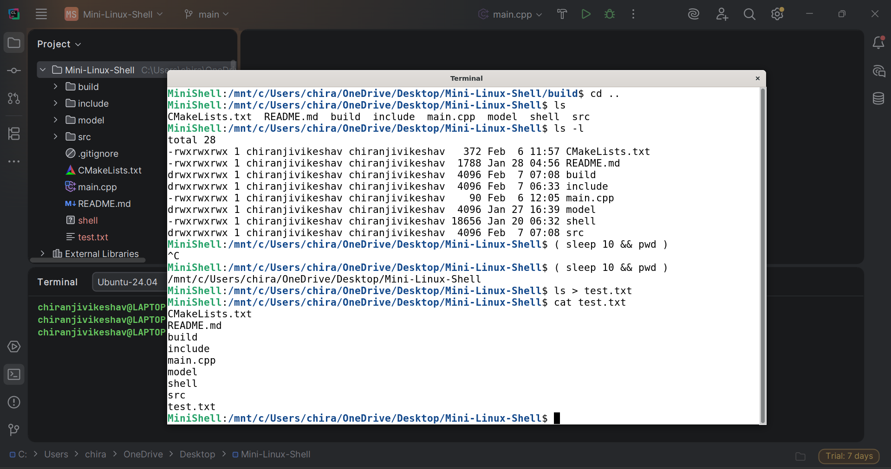

# Mini-Linux-Shell
A Unix-style mini shell implemented in C++ that supports complex command parsing and execution using an AST-based architecture.


# Featured Implemented
- Execution of external commands using `fork`, `execvp`, and `waitpid`.
- Abstract Syntax Tree (AST) – based parsing for complex command structures.
- Logical operators:
  - `&&` (AND)
  - `||` (OR)
- Sequence - `;`
- Pipelines using - `|`
- Input/output/error redirections:
  -  `<`, `>`, `>>`, `2>`
- Subshell support using parentheses `( ... )` with correct scope isolation.
- Built-in commands like `cd`, `exit`, etc.
- Accurate exit-status propagation enabling correct short-circuit logic.
- Parent/child process separation for built-ins and subshells.
- Signal handling: Supports Ctrl+C interruption for foreground commands and subshell execution, with signal isolation between parent shell and child processes.
# Architecture Overview
The shell follows a modular design:
> **Tokenizer → Parser → AST → Executor**
- ### Tokenizer
  Converts raw input into tokens (commands, operators, redirections, parentheses).
- ### Parser
  Builds an AST respecting operator precedence:
  > `;`  → lowest\
  > `&&` and `||`\
  > `|`\
  > command/subshell → highest
- ### AST Nodes
  - Command
  - Pipeline
  - Logical
  - Sequence
  - Subshell
- ### Executor
  - Recursively evaluates AST nodes using post-order traversal
  - Forks processes where required
  - Preserves shell state for built-ins
# Tech Stack
- **Language:** C++
- **Build System:** CMake
- **Platform:** Linux / WSL
# Build Instructions
```bash
mkdir build
cd build
cmake ..
make
./minishell 
```
# Limitations
While testing commands, ensure that whitespace is added between consecutive tokens.\
For examples:
- `(ls)` → `( ls )`
- `pwd; ls` → `pwd ; ls` 
### Connect with Me
- LinkedIn: https://www.linkedin.com/in/chiranjivi-keshav-907156232/
